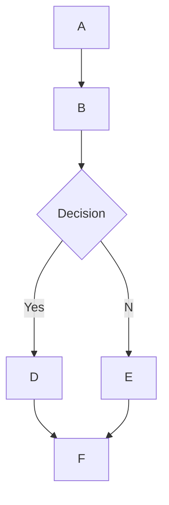

# 🌊 Open WebUI 中的 MermaidJS 渲染支持

## 概述

Open WebUI 支持在聊天界面中直接渲染美观的 MermaidJS 图表、流程图、饼图等。MermaidJS 是一款强大的工具，能够可视化复杂的信息和想法。当与大型语言模型（LLM）结合使用时，它能成为生成和探索新想法的强大工具。

## 在 Open WebUI 中使用 MermaidJS

要生成一个 MermaidJS 图表，只需在任何聊天中向 LLM 请求创建一个图表或图表即可。例如，你可以让 LLM：

* “请用 Mermaid 为我创建一个简单的决策流程图，并解释该流程图的工作原理。”
* “用 Mermaid 可视化一个决策树，以判断是否适合外出散步。”

请注意，为了正确渲染 LLM 的响应，其内容必须以 `mermaid` 开头，后面紧跟着 MermaidJS 代码。你可以参考 [MermaidJS 文档](https://mermaid.js.org/intro/) 确保语法正确，并提供结构化的提示来引导 LLM 生成更佳的 MermaidJS 代码。

## 在聊天中直接可视化 MermaidJS 代码

当你请求 MermaidJS 可视化时，大型语言模型（LLM）会生成必要的代码。只要代码使用的是有效的 MermaidJS 语法，Open WebUI 将自动在聊天界面中渲染该可视化内容。

如果模型生成了 MermaidJS 语法但未能成功渲染，通常意味着代码中存在语法错误。别担心——一旦响应完全生成，你会收到错误通知。发生这种情况时，可以参考 [MermaidJS 文档](https://mermaid.js.org/intro/) 来识别问题并相应地修改提示。

## 与你的可视化互动

一旦可视化显示出来，你可以：

* 放大缩小以仔细查看。
* 通过点击显示区域右上角的复制按钮，复制用于生成可视化的原始 MermaidJS 代码。

### 示例



这将生成如下流程图：

```markdown
 startAncestor [ start ]
A[A] --> B[B]
B --> C[Decision]
C -->| Yes | D[D]
C -->| No  | E[E]
D --> F[F]
E --> F[F]
```

尝试不同的图表类型有助于你更好地掌握如何在 Open WebUI 中有效利用 MermaidJS。对于较小的模型，可以参考 [MermaidJS 文档](https://mermaid.js.org/intro/) 提供指导，或者让 LLM 总结文档内容，形成全面的笔记或系统提示。遵循这些指南并探索 MermaidJS 的功能，你就能充分发挥这一强大工具在 Open WebUI 中的潜力。