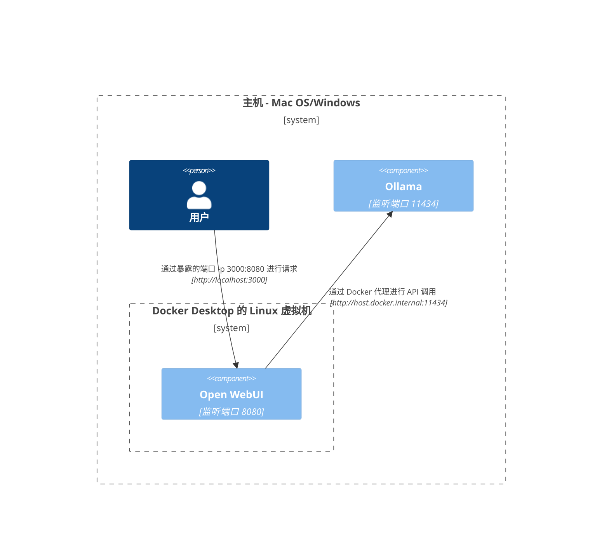
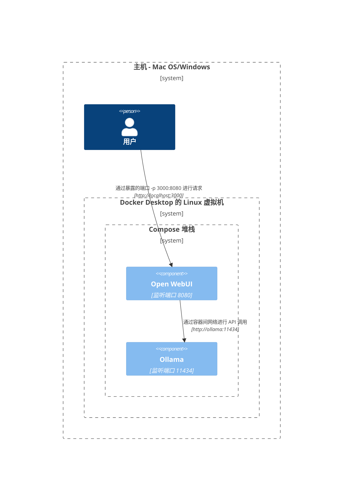
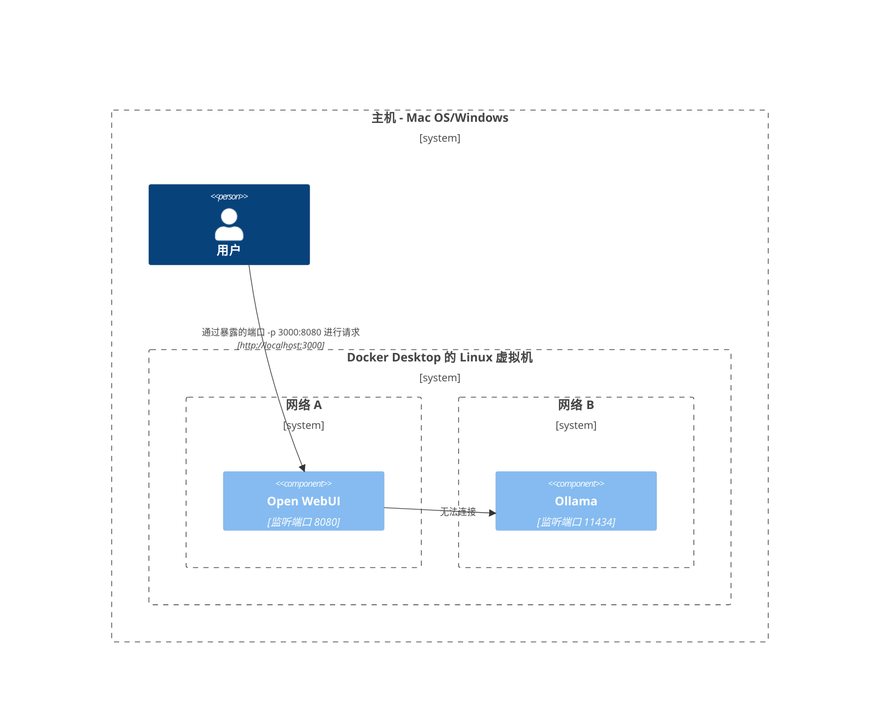
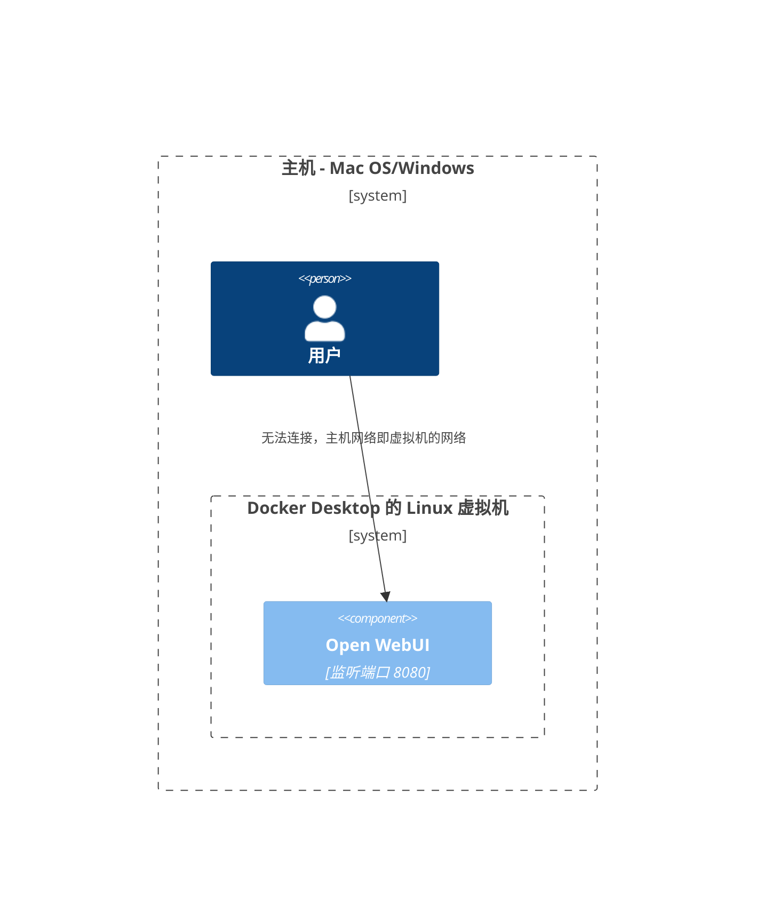
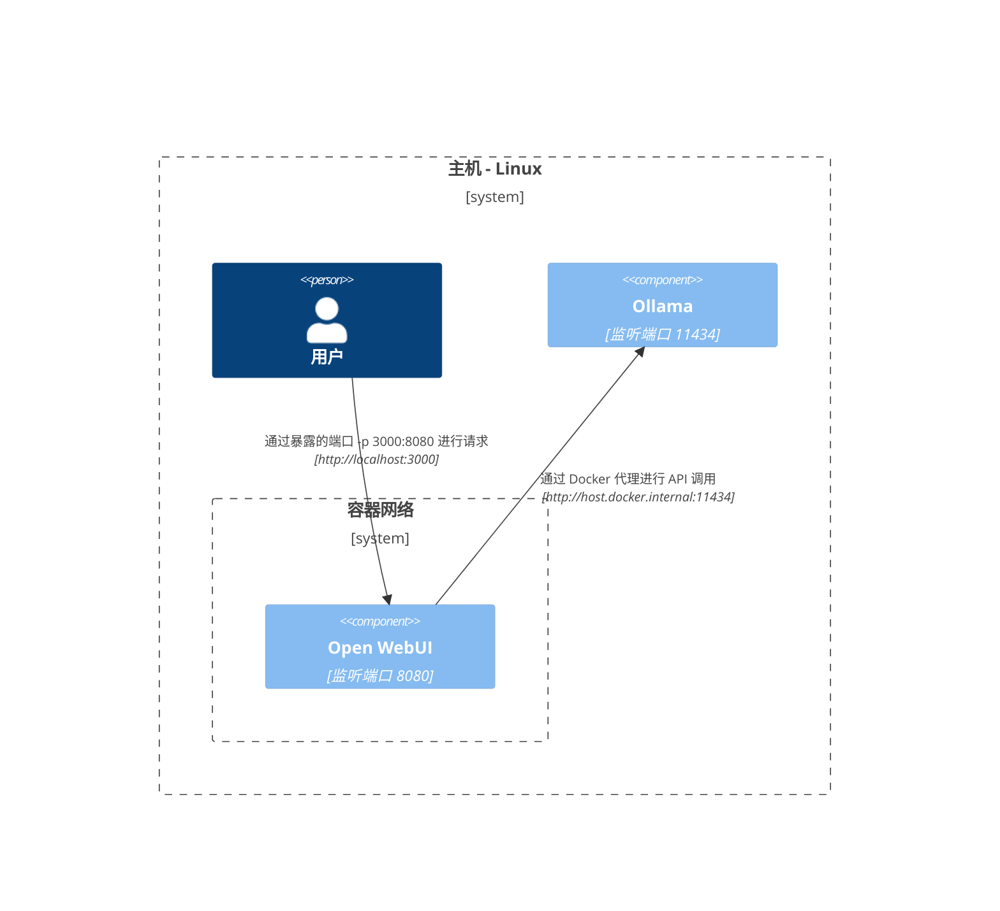
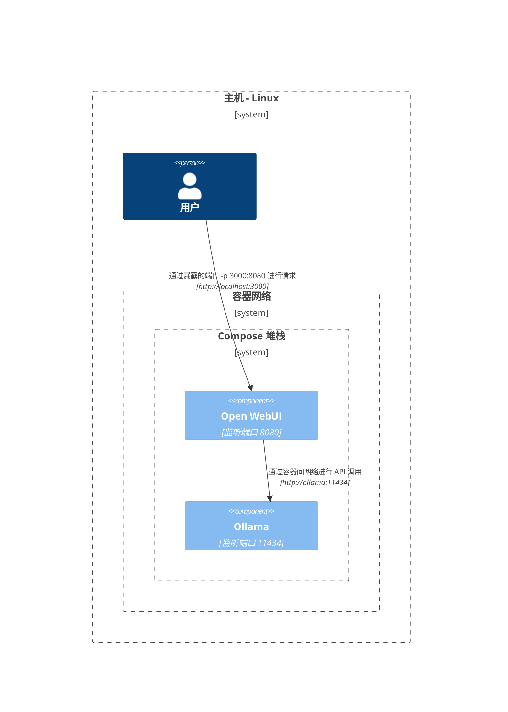
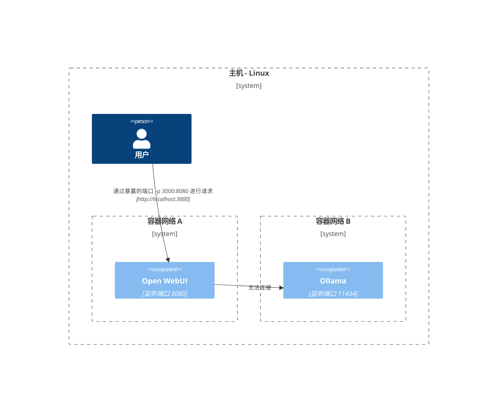
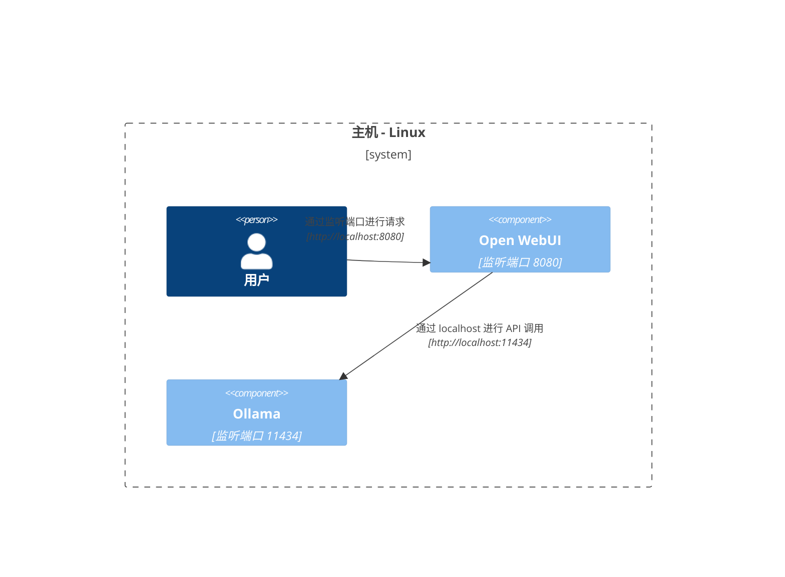

在这里，我们提供了清晰且结构化的图表，帮助您理解网络中的各个组件在不同配置下的交互方式。本文档旨在为 macOS/Windows 和 Linux 用户提供帮助。每个场景均使用 Mermaid 图表来展示如何根据不同的系统配置和部署策略设置交互。

## Mac OS/Windows 配置选项 🖥️

### 主机上运行 Ollama，在容器中运行 Open WebUI

在这种情况下，`Ollama` 直接在主机上运行，而 `Open WebUI` 则在 Docker 容器内运行。

### 在同一 Docker Compose 堆栈中配置 Ollama 和 Open WebUI

`Ollama` 和 `Open WebUI` 都配置在同一 Docker Compose 堆栈中，简化了网络通信。

### Ollama 和 Open WebUI 分别部署在不同的 Docker 网络中

在这种情况下，`Ollama` 和 `Open WebUI` 部署在不同的 Docker 网络中，可能导致连接问题。

### Open WebUI 使用主机网络

在这种配置下，`Open WebUI` 使用主机网络，这可能影响其在某些环境中的连接能力。

## Linux 配置选项 🐧

### 主机上运行 Ollama，在容器中运行 Open WebUI（Linux）

此图专为 Linux 平台设计，其中 `Ollama` 在主机上运行，而 `Open WebUI` 部署在 Docker 容器内。

### 在同一 Docker Compose 堆栈中配置 Ollama 和 Open WebUI（Linux）

在此设置中，`Ollama` 和 `Open WebUI` 都位于同一个 Docker Compose 堆栈中，允许在 Linux 上进行直接的网络通信。

### Ollama 和 Open WebUI 分别部署在不同的 Docker 网络中（Linux）

在这种情况下，`Ollama` 和 `Open WebUI` 部署在不同的 Docker 网络中，可能会阻碍连接。

### Open WebUI 和 Ollama 都使用主机网络（Linux）

这是一种最佳布局，`Open WebUI` 和 `Ollama` 都使用主机的网络，从而在 Linux 系统上实现无缝交互。

每种配置针对不同的部署策略和网络配置，帮助您选择最适合需求的布局。
